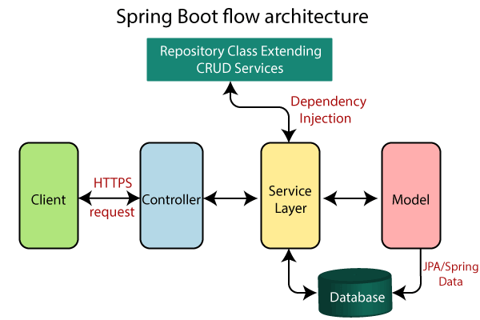

# Spring Introduction - REST Service


This is a "getting started" project with the Spring Boot framework, in which we build a simple REST service.

First go to the [Spring Initializr](https://start.spring.io/) to download a Spring project template.
Choose **Maven** in *Project*, Choose **Java** in *Language*. 
Choose a version of Spring Boot, for example **3.5.4**.
(Note that this project uses Spring Boot 3.3.2.)
Choose **Jar** in *Packaging* and **Java 21** (don't use Java 24!).
In *Dependencies*, add **Web**, **JPA** and **H2**.

Click "GENERATE", download and extract the zip file. Open the project folder in the IDE.


This sample project includes a simple library application.
Understand each layer in the project repository.


(Image from https://dzone.com/articles/spring-boot-architecture-and-workflow)

### Demonstration: Sample REST Requests
After running the Spring application, interact with it by using REST requests. 
The following are examples of requests in the Windows Command Prompt (_note. commands in PowerShell are different_)
or MacOS/Linux Terminal.

- Request 1. 

In Windows CMD,
```shell
curl -X POST -H "Content-Type:application/json" -d "{\"name\":\"My Library\"}" http://localhost:8081/libraries
```
In MacOS/Linux,
```bash
curl -X POST -H "Content-Type:application/json" -d '{"name":"My Library"}' http://localhost:8081/libraries
```
which returns
```json
{"id":1,"name":"My Library"}
```

- Request 2.
  In Windows CMD,
```shell
curl -X POST -H "Content-Type:application/json" -d "{\"location\":\"Main Street nr 5\"}" http://localhost:8081/addresses
```
In MacOS/Linux,
```bash
curl -X POST -H "Content-Type:application/json" -d '{"location":"Main Street nr 5"}' http://localhost:8081/addresses
```
which returns 
```json
{"id":2,"location":"Main Street nr 5","library":null}
```

- Request 3.
```shell
curl -i -X PUT http://localhost:8081/libraries/1/address/2
```
which returns
```json
{"id":1,"name":"My Library"}
```

- Request 4.
```shell
curl -X GET http://localhost:8081/addresses/2
```
which returns
```json
{"id":2,"location":"Main Street nr 5","library":{"id":1,"name":"My Library"}}
```
_Note that the value of `"library"` has been updated from `null` to `{"id":1,"name":"My Library"}`._
